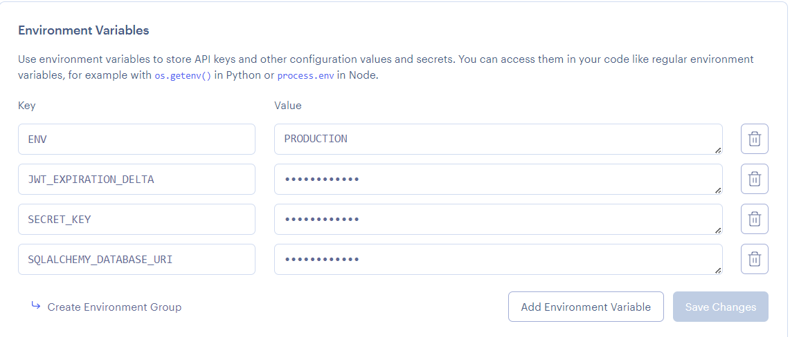

[](https://gitpod.io/#https://github.com/uwidcit/flaskmvc)
<a href="https://render.com/deploy?repo=https://github.com/uwidcit/flaskmvc">
  
</a>


# Flask MVC Template
A template for flask applications structured in the Model View Controller pattern [Demo](https://dcit-flaskmvc.herokuapp.com/). [Postman Collection](https://documenter.getpostman.com/view/583570/2s83zcTnEJ)


# Dependencies
* Python3/pip3
* Packages listed in requirements.txt

# Installing Dependencies
```bash
$ pip install -r requirements.txt
```

# Configuration Management


Configuration information such as the database url/port, credentials, API keys etc are to be supplied to the application. However, it is bad practice to stage production information in publicly visible repositories.
Instead, all config is provided by a config file or via [environment variables](https://linuxize.com/post/how-to-set-and-list-environment-variables-in-linux/).

## In Development

When running the project in a development environment (such as gitpod) the app is configured via default_config.py file in the App folder. By default, the config for development uses a sqlite database.

default_config.py
```python
SQLALCHEMY_DATABASE_URI = "sqlite:///temp-database.db"
SECRET_KEY = "secret key"
JWT_ACCESS_TOKEN_EXPIRES = 7
ENV = "DEVELOPMENT"
```

These values would be imported and added to the app in load_config() function in config.py

config.py
```python
# must be updated to inlude addtional secrets/ api keys & use a gitignored custom-config file instad
def load_config():
    config = {'ENV': os.environ.get('ENV', 'DEVELOPMENT')}
    delta = 7
    if config['ENV'] == "DEVELOPMENT":
        from .default_config import JWT_ACCESS_TOKEN_EXPIRES, SQLALCHEMY_DATABASE_URI, SECRET_KEY
        config['SQLALCHEMY_DATABASE_URI'] = SQLALCHEMY_DATABASE_URI
        config['SECRET_KEY'] = SECRET_KEY
        delta = JWT_ACCESS_TOKEN_EXPIRES
...
```

## In Production

When deploying your application to production/staging you must pass
in configuration information via environment tab of your render project's dashboard.



# Flask Commands

wsgi.py is a utility script for performing various tasks related to the project. You can use it to import and test any code in the project. 
You just need create a manager command function, for example:

```python
# inside wsgi.py

user_cli = AppGroup('user', help='User object commands')

@user_cli.cli.command("create-user")
@click.argument("username")
@click.argument("password")
def create_user_command(username, password):
    create_user(username, password)
    print(f'{username} created!')

app.cli.add_command(user_cli) # add the group to the cli

```

Then execute the command invoking with flask cli with command name and the relevant parameters

```bash
$ flask user create bob bobpass
```

## CLI Commands For Internship Platform (Assigned Project)

This project includes a comprehensive CLI interface for managing internships, users, and applications. Before using any CLI commands, ensure you have initialized the database and are logged in as the appropriate user type.

### Prerequisites

1. **Initialize the database** (required before first use):
   ```bash
   $ flask init
   ```

2. **Login as appropriate user** before executing commands:
   ```bash
   $ flask login user-login <user_type> <username> <password>
   ```
   Where `user_type` is one of: `student`, `employer`, `staff`

3. **Default Users Credentials** (created during initialization, must be used):
   - Student: `student1` / `password1`
   - Employer: `employer1` / `password1`
   - Staff: `staff1` / `password1`

**Note** - All ID fields, start at **1**

### Authentication Commands

#### Login
```bash
$ flask login user-login <user_type> <username> <password>
```
**Purpose:** Log in as a specific user type to access role-specific commands.

**Arguments:**
- `user_type`: Type of user (`student`, `employer`, `staff`)
- `username`: Username for the account
- `password`: Password for the account

**Example:**
```bash
$ flask login user-login employer employer1 password1
```

#### Logout
```bash
$ flask logout user-logout
```
**Purpose:** Log out the current user and clear the session.

### Staff Commands

Staff members can manage internship shortlists and view all internships.

```bash
$ flask staff <command>
```

#### Add Student to Shortlist
```bash
$ flask staff add-student <student_id> <internship_id>
```
**Purpose:** Add a student to an internship shortlist.

**Arguments:**
- `student_id`: ID of the student to add
- `internship_id`: ID of the internship position

**Example:**

```bash
flask staff add-student 1 1
```

**Requirements:** Must be logged in as staff.

#### List All Internships
```bash
$ flask staff list-internships
```
**Purpose:** View all available internship positions.

**Requirements:** Must be logged in as staff.

### Employer Commands

Employers can create internships, view shortlisted applicants, and respond to the shortlist.

```bash
$ flask employer <command>
```

#### Create Internship
```bash
$ flask employer create-internship <title> <description> <location> <duration> <salary>
```
**Purpose:** Create a new internship position.

**Arguments:**
- `title`: Job title/position name
- `description`: Job description and requirements
- `location`: Work location
- `duration`: Length of internship in months
- `salary`: Compensation amount

**Requirements:** Must be logged in as employer.

**Example:**
```bash
$ flask employer create-internship "Software Intern" "Python, Flask development" "Remote" "3" "1000"
```

#### Accept Student
```bash
$ flask employer accept-student <shortlist_id>
```
**Purpose:** Accept a student from the shortlist for an internship.

**Arguments:**
- `shortlist_id`: ID of the shortlist entry

**Requirements:** Must be logged in as employer who owns the internship.

#### Reject Student
```bash
$ flask employer reject-student <shortlist_id>
```
**Purpose:** Reject a student from the shortlist for an internship.

**Arguments:**
- `shortlist_id`: ID of the shortlist entry

**Requirements:** Must be logged in as employer who owns the internship.

#### View Applications for Specific Internship
```bash
$ flask employer view-shortlist <internship_id>
```
**Purpose:** View all student applications for a specific internship.

**Arguments:**
- `internship_id`: ID of the internship position

**Requirements:** Must be logged in as employer who owns the internship.

#### View All Applications
```bash
$ flask employer view-all-shortlist
```
**Purpose:** View all student applications across all employer's internships.

**Requirements:** Must be logged in as employer.

### Student Commands

Students can view their shortlisted positions and employer responses.

```bash
$ flask student <command>
```

#### View All Shortlisted Positions
```bash
$ flask student view-all-shortlist
```
**Purpose:** View all internships the student has been shortlisted for.

**Requirements:** Must be logged in as student.

**Output:** List of shortlist entries with internship details.

#### View Employer Response
```bash
$ flask student view-employer-response <shortlist_id>
```
**Purpose:** View employer's response (accepted/rejected) for a specific shortlist entry.

**Arguments:**
- `shortlist_id`: ID of the shortlist entry

**Requirements:** Must be logged in as student.

**Output:** Response status and details, or error if no response exists.

### Usage Examples

#### Complete Workflow Example

1. **Initialize system:**
   ```bash
   $ flask init
   ```

2. **Employer creates internship:**
   ```bash
   $ flask login user-login employer employer1 password1
   $ flask employer create-internship "Data Analyst" "Python, SQL, Analytics" "Hybrid" "6" "1500"
   ```

3. **Staff adds student to shortlist:**
   ```bash
   $ flask login user-login staff staff1 password1
   $ flask staff add-student 1 1
   ```

4. **Employer responds to application:**
   ```bash
   $ flask login user-login employer employer1 password1
   $ flask employer accept-student 1
   ```

5. **Student views response:**
   ```bash
   $ flask login user-login student student1 password1
   $ flask student view-employer-response 1
   ```

# Running the Project

_For development run the serve command (what you execute):_
```bash
$ flask run
```

_For production using gunicorn (what the production server executes):_
```bash
$ gunicorn wsgi:app
```

# Deploying
You can deploy your version of this app to render by clicking on the "Deploy to Render" link above.

# Initializing the Database
When connecting the project to a fresh empty database ensure the appropriate configuration is set then file then run the following command. This must also be executed once when running the app on heroku by opening the heroku console, executing bash and running the command in the dyno.

```bash
$ flask init
```

# Database Migrations
If changes to the models are made, the database must be'migrated' so that it can be synced with the new models.
Then execute following commands using manage.py. More info [here](https://flask-migrate.readthedocs.io/en/latest/)

```bash
$ flask db init
$ flask db migrate
$ flask db upgrade
$ flask db --help
```

# Testing

## Unit & Integration
Unit and Integration tests are created in the App/test. You can then create commands to run them. Look at the unit test command in wsgi.py for example

```python
@test.command("user", help="Run User tests")
@click.argument("type", default="all")
def user_tests_command(type):
    if type == "unit":
        sys.exit(pytest.main(["-k", "UserUnitTests"]))
    elif type == "int":
        sys.exit(pytest.main(["-k", "UserIntegrationTests"]))
    else:
        sys.exit(pytest.main(["-k", "User"]))
```

You can then execute all user tests as follows

```bash
$ flask test user
```

You can also supply "unit" or "int" at the end of the comand to execute only unit or integration tests.

You can run all application tests with the following command

```bash
$ pytest
```

## Test Coverage

You can generate a report on your test coverage via the following command

```bash
$ coverage report
```

You can also generate a detailed html report in a directory named htmlcov with the following comand

```bash
$ coverage html
```

# Troubleshooting

## Views 404ing

If your newly created views are returning 404 ensure that they are added to the list in main.py.

```python
from App.views import (
    user_views,
    index_views
)

# New views must be imported and added to this list
views = [
    user_views,
    index_views
]
```

## Cannot Update Workflow file

If you are running into errors in gitpod when updateding your github actions file, ensure your [github permissions](https://gitpod.io/integrations) in gitpod has workflow enabled 

## Database Issues

If you are adding models you may need to migrate the database with the commands given in the previous database migration section. Alternateively you can delete you database file.
